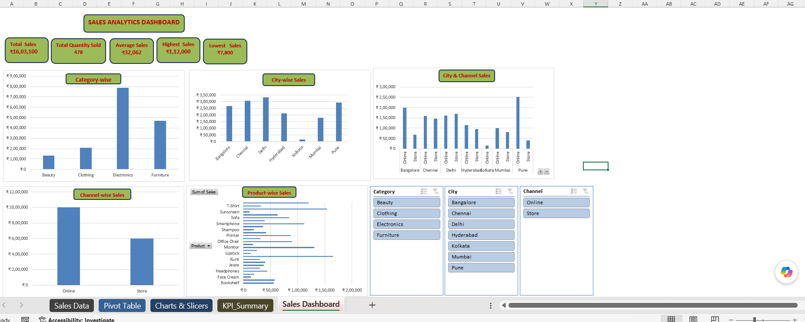

# Retail Sales Dashboard

An interactive **Retail Sales Analytics Dashboard** built using **Microsoft Excel** to analyze sales performance across categories, cities, products, and sales channels.

## 📊 Dashboard Preview

## 🛠️ Tools & Techniques

* Microsoft Excel
* Pivot Tables
* Pivot Charts
* KPI Cards
* Slicers
* Excel Formulas
* Data Analysis & Visualization

## 📈 Dashboard Features

* Total Sales KPI
* Total Quantity Sold
* Average Sales
* Highest Sales
* Lowest Sales
* Category-wise Sales Analysis
* City-wise Sales Analysis
* Product-wise Sales Analysis
* Channel-wise Sales Analysis
* City & Channel Sales Analysis
* Interactive Category, City, and Channel Slicers

## 🔍 Key Insights

* **Total Sales:** ₹16,03,100
* **Total Quantity Sold:** 478 units
* **Average Sales:** ₹32,062
* **Highest Single Sale:** ₹1,12,000
* **Lowest Single Sale:** ₹7,800
* **Top Category:** Electronics
* **Top Sales Channel:** Online

## 📁 Project Files

* `Retail Sales Dashboard.xlsx` — Complete Excel workbook with data, formulas, Pivot Tables, Pivot Charts, Slicers, and Dashboard.
* `Retail-Sales-Dashboard.png` — Dashboard preview image.

## 🎯 Project Objective

The objective of this project is to analyze retail sales data and create an interactive Excel dashboard that provides clear insights into sales performance and helps users explore the data using interactive slicers.

